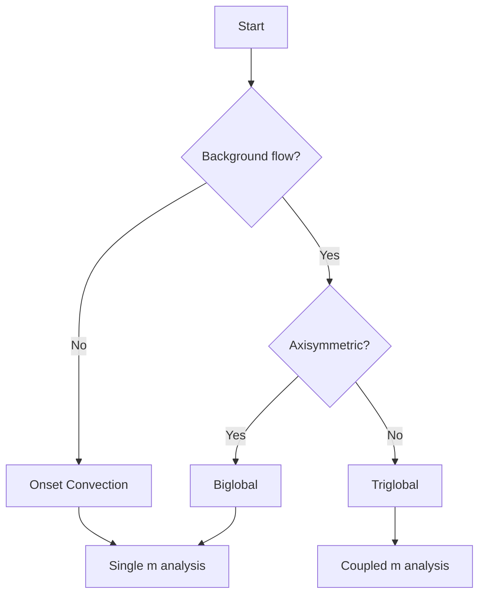

# Analysis Modes

<div class="magrathea-hero">
  <div class="magrathea-eyebrow">Three ways to analyze stability</div>
  <h1>Pick the mode that matches your background flow.</h1>
  <p>
    From classical onset with no mean flow, through axisymmetric biglobal analysis,
    to fully 3-D mode-coupled triglobal analysis &mdash; each tuned to a different
    physical scenario.
  </p>
</div>

## Overview

<div class="magrathea-card-grid">
  <div class="magrathea-card">
    <strong><a href="onset_convection/">Onset convection</a></strong>
    <p>Conductive base state, no mean flow. Each azimuthal mode <em>m</em> is independent. Classical convection onset.</p>
  </div>
  <div class="magrathea-card">
    <strong><a href="biglobal_stability/">Biglobal</a></strong>
    <p>Axisymmetric (<em>m</em> = 0) mean flow &mdash; thermal wind, zonal jets. Perturbation modes stay decoupled.</p>
  </div>
  <div class="magrathea-card">
    <strong><a href="triglobal_stability/">Triglobal</a></strong>
    <p>Non-axisymmetric mean flow. Modes couple via Gaunt coefficients. CMB heterogeneity, tidal forcing.</p>
  </div>
</div>

## Choosing the Right Analysis Mode



### Onset Convection (No Mean Flow)

**Physical scenario**: Pure thermal convection in a rotating shell with a conductive temperature profile and no pre-existing flows.

**Key characteristics**:

- Base state: ``\bar{T}(r)`` conductive profile, ``\bar{\mathbf{u}} = 0``
- Each azimuthal mode ``m`` is independent
- Seek critical Rayleigh number ``Ra_c(m)`` and minimum over ``m``
- Thermal Rossby waves with prograde drift

**Typical applications**:

- Planetary core convection onset
- Laboratory rotating convection experiments
- Fundamental scaling law verification

[Learn more about Onset Convection](onset_convection.md)

---

### Biglobal (Axisymmetric Mean Flow)

**Physical scenario**: Stability analysis when the background has latitudinal (but not longitudinal) structure, such as thermal wind driven by pole-equator temperature differences.

**Key characteristics**:

- Base state: ``\bar{T}(r, \theta)``, ``\bar{u}_\phi(r, \theta)`` with ``m = 0`` components only
- Each perturbation mode ``m`` still independent
- Mean flow advection modifies growth rates and drift
- Zonal flow can stabilize or destabilize

**Typical applications**:

- Earth's core with CMB heat flux variations (axisymmetric part)
- Differentially rotating boundaries
- Thermal wind studies

[Learn more about Biglobal Analysis](biglobal_stability.md)

---

### Triglobal (Non-Axisymmetric Mean Flow)

**Physical scenario**: Full 3D stability when the background breaks longitudinal symmetry, introducing mode coupling between different azimuthal wavenumbers.

**Key characteristics**:

- Base state: ``\bar{T}(r, \theta, \phi)``, ``\bar{\mathbf{u}}(r, \theta, \phi)`` with ``m \neq 0``
- Perturbation modes couple: ``m \leftrightarrow m \pm m_{bs}``
- Block matrix structure with coupling through Gaunt coefficients
- Significantly larger computational cost

**Typical applications**:

- Earth's core with full CMB heat flux heterogeneity
- Mercury's 3:2 spin-orbit resonance
- Tidally forced bodies (Io, Europa)
- Stars with active regions

[Learn more about Triglobal Analysis](triglobal_stability.md)

---

## Comparison Summary

### Mathematical Complexity

| Aspect | Onset | Biglobal | Triglobal |
|--------|-------|----------|-----------|
| Basic state ``m`` values | 0 | 0 | 0, ``\pm 1``, ``\pm 2``, ... |
| Advection terms | ``u'_r \cdot \nabla \bar{T}`` | + ``\bar{\mathbf{u}} \cdot \nabla \mathbf{u}'`` | + mode coupling |
| Matrix structure | Block diagonal | Block diagonal | Block tridiagonal (or wider) |
| Independent problems | One per ``m`` | One per ``m`` | One coupled system |

### Computational Requirements

| Aspect | Onset | Biglobal | Triglobal |
|--------|-------|----------|-----------|
| Memory | ~100 MB | ~100 MB | ~10-100 GB |
| Single solve time | Seconds | Seconds-minutes | Minutes-hours |
| Parallelization | Over ``m`` | Over ``m`` | Within coupled solve |

### Physical Effects Captured

| Effect | Onset | Biglobal | Triglobal |
|--------|-------|----------|-----------|
| Thermal Rossby waves | Yes | Yes | Yes |
| Coriolis coupling | Yes | Yes | Yes |
| Mean flow advection | No | Yes | Yes |
| Thermal wind | No | Yes | Yes |
| Zonal flow shear | No | Yes | Yes |
| Longitudinal heterogeneity | No | No | Yes |
| Mode energy transfer | No | No | Yes |

## Quick Start Examples

### Onset Convection

```julia
using Magrathea

params = OnsetParams(E=1e-5, Pr=1.0, Ra=1e7, χ=0.35, m=10, lmax=60, Nr=64)
result = solve(OnsetProblem(params); nev=6)
result.growth_rate
```

### Biglobal

```julia
using Magrathea

params = OnsetParams(E=1e-5, Pr=1.0, Ra=1e7, χ=0.35, m=10, lmax=60, Nr=64)
bs = basic_state(params; mode=:meridional, amplitude=0.05)
result = solve(BiglobalProblem(params, bs); nev=6)
```

### Triglobal

```julia
using Magrathea

params = OnsetParams(E=1e-5, Pr=1.0, Ra=1e7, χ=0.35, lmax=40, Nr=48)
bs3d = basic_state(params; mode=:nonaxisymmetric, mmax_bs=2)
result = solve(TriglobalProblem(params, bs3d, -5:5); nev=6)
```
